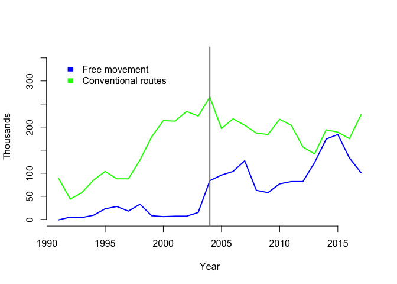
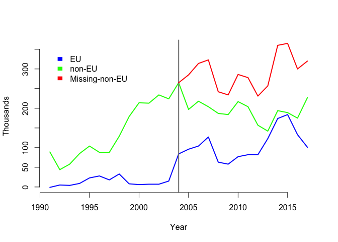

I'm interested in the effect that EU-free-movement had on migrant access via conventional routes. By 'conventional routes' I mean the non-country-specific ways that migrants can come to the UK, e.g. through visas or marriage, as opposed to freedom of movement within the EU. Rather than go back to the start of free movement with Europe, I focused on the effect of the [expansion of the Union from
2004](https://eu.boell.org/en/2014/06/10/europe-after-eastern-enlargement-european-union-2004-2014).

The problem, of course, is estimating the number of migrants
there *would* have been through conventional routes without the expansion [1]. Recent [reports from
the Office of National Statistics
(ONS)](https://www.ons.gov.uk/peoplepopulationandcommunity/populationandmigration/internationalmigration/bulletins/migrationstatisticsquarterlyreport/may2019)
gave me an idea for a method of working it out. The numbers have shown
that as EU migration to the UK has fallen, non-EU migrants are taking up
the slack. Economists have concluded that [UK employers are willing to
make the extra effort to sponsor
migrants](https://www.newstatesman.com/politics/staggers/2019/05/when-it-comes-immigration-uk-already-post-brexit-era)
when fewer bureaucratic options are available.

Importantly, this implies that over the short term there is roughly a
total number of jobs or other social positions that can be filled by
migration each year [2]. Therefore, we can estimate the number of
migrants from conventional routes that there would have been without the expansion of the EU by adding the number of migrants who came to the UK using freedom of movement. 

The ONS data comes in multiple tables with lots of detail, but
fortunately the [Migration Observatory at Oxford
University](https://migrationobservatory.ox.ac.uk/resources/briefings/long-term-international-migration-flows-to-and-from-the-uk/)
have compiled the annual net migration data by EU/non-EU, which can be
downloaded as a [.csv file](net-migration-by-citizen.csv). The file
lists the net number (in thousands) of migrants coming to
the UK between 1991 and 2017 [3], through free movement ('EU') or by conventional routes ('non-EU'). Note that migrants from
countries who joined the EU around 2004 are counted as coming through 'non-EU/conventional routes' before
2004, and 'EU/free movement' after. For the purpose of this analysis that makes sense:
I am looking at disparities in access according to whether
using freedom of movement or conventional means, and not singling-out
migration from particular countries.

I loaded the data into [R](https://www.r-project.org), a free
statistical software [4]. The raw data is presented in the simple graph
below. We can
see the strong upward trend in conventional migration from 1991 to 2004 (green
line), and subsequent levelling-off or slight decline. In contrast, the
blue line showing EU-free-movement migration is relatively flat before 2004, after which it jumps up.

I did a couple of small calculations (in the code at the end) to get a
rough estimate of the number of migrants from conventional routes that there *would have
been* had the EU not expanded in 2004 (the 'missing' non-EU migrants). I
added the number of EU migrants to the number of non-EU migrants after
2004; using the same logic applied to the recent
ONS figures, the assumption is that the total number of positions would have been filled by a
mix of EU and non-EU migrants. Since there was a constant level of net migration from the
EU before 2004, I subtracted the median migration between 1991 and 2003
from each year after 2003.

The number of migrants that would have come through conventional routes had there not been
the expansion of the EU in 2004 is shown in red on the graph below. 

The total 'missing' migrants from conventional routes is the sum of the difference between
the red and green lines, which is 2,572,000. Since the Migration
Observatory estimates the non-EU foreign-born population in the UK in 2017
was [5,677,000](https://migrationobservatory.ox.ac.uk/resources/briefings/migrants-in-the-uk-an-overview/),
the 'missing' are 31% of the total non-EU population that would be living
in the UK had there been no EU expansion in 2004. In other words: the non-EU-born population of the UK in 2017 would have been 45% higher than it was. (N.B. this is a slight over-estimate since the Migration Observatory figure for 2017 doesn't include nationals of countries that joined the EU in 2004 and in our counterfactual scenario they would count as having arrived through conventional means.)

This is a crude analysis, and a very rough estimate. There are of course assumptions, such as
that the economy would have grown at the same rate, which could affect
the result. It's somewhat confusing having people from countries that
joined the EU in 2004 count in different groups depending on the year;
another analysis might break these down, but I am more interested in the
route of access than in which countries people are coming from. 

## Code to add the figures after 2003

    m91_03 <- median(d[1:13,5]) # median migration before 2003
    d$nonEU.plus <- d$Non.EU + d$EU - m91_03
    d[1:14,6] <- d[1:14,4]

[1] This is known as the 'counterfactual', what happened counter to
fact, and estimating this is the main problem in causal analysis
because, by definition, it isn't observed.

[2] The total number of posts (jobs, relationships) can increase because
of the effects of migration on the economy, it's not that there's a
limit to the size the country/economy could become, however that takes
time. It's a dynamic process, but in the short-run it seems like a
plausible simplification to say there are a finite number of posts.

[3] 2018-2019 would be possible but require downloading the ONS data). Also, the figures for EU migration from 2004 to 2007 are underestimated because of a problem with measurement.

[4] All the code for this post is available [here](Graph.Rmd).

