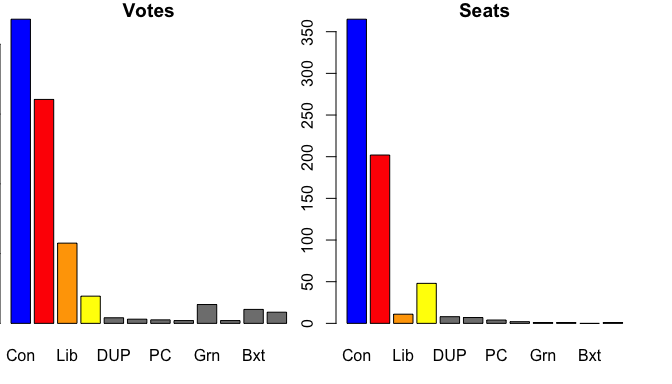
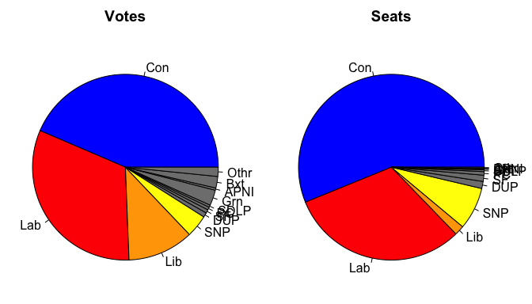
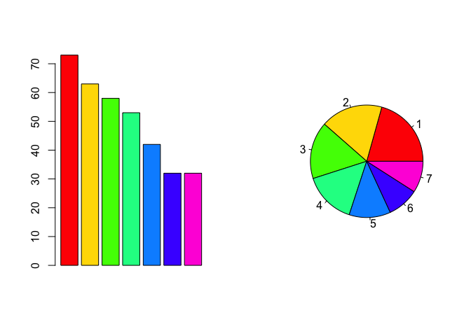

There is a common opinion that pie charts are _verboten_. 
A sign of a novice analyst.
Who might, god forbid, have made the chart in Excel.

However, I have recently come across a situation where pie charts are the ideal choice.
And the situation is not all that peculiar. 
It is the situation where the message is about how the parts make up a whole.
When the point is not to dissect, but compile.

This came to me when interpreting a working-style quiz (which I will come to later) but I think that the idea is better represented using the example of the recent UK parliamentary elections. 
Because of how the elections work, it is natural to want to _dissect_ the results to identify the _largest_ party, since they will form the next government.
The rest of the parties matter much less (as long as there is not a hung parliament) and for this purpose the bar charts below makes the point well. 

<!-- -->

However, bar charts are less good when what we want is to say something overall about how the country voted. 
Instead of partitioning the country into different votes or seats, we want to present the overall 'tapestry'. 
For this, a pie chart is more appropriate, because it presents a whole (pie) and how it is made up.
It also doesn't over-emphasise the ordering of the categories in addition to their magnitude.

<!-- -->

As I said, I started to think about this when my team completed a working-styles test and were comparing the results.
The results were presented as a bar chart of how much people were of each 'type'.
I've replicated my results below to show what I mean (I've omitted what these types are supposed to be since a. I am not sure they're all that meaningful and b. it would take a lot of explaining).
Most people focused all of their discussion and interpretation on the first of these, even when others were not far behind.
I think that this had a lot to do with how the data were presented in a bar chart, when in fact a pie chart would be more appropriate since the results were intended to say something about the 'whole' person, not the amount that different personality traits contributed to matching someone to a type. 

To me, the same applies with the charts above.
The pie charts do a better job of describing the whole.
The voting one, in particular, does a good job of showing that far from being a country overwhelmed by Conservative support, it's actually quite a mix. 
Which is the most important point: the country is not one thing, not the biggest group, but is a tapestry of differences. 

<!-- -->

