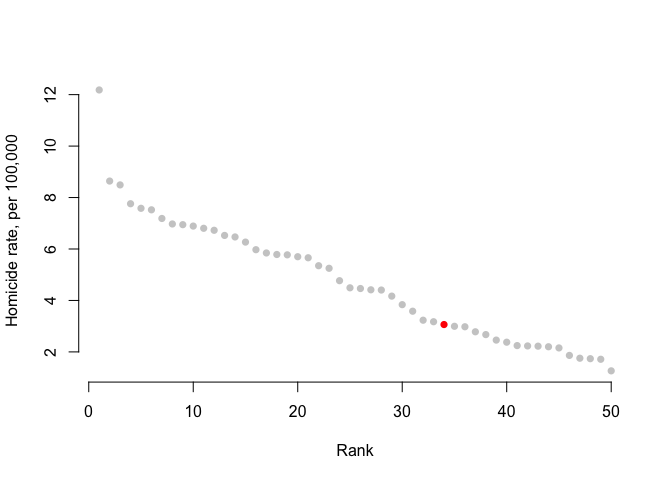
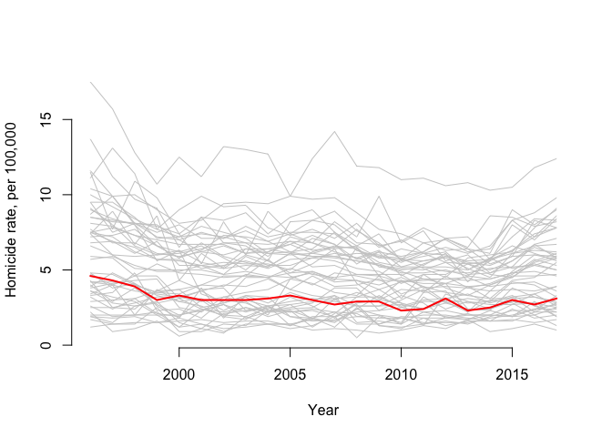
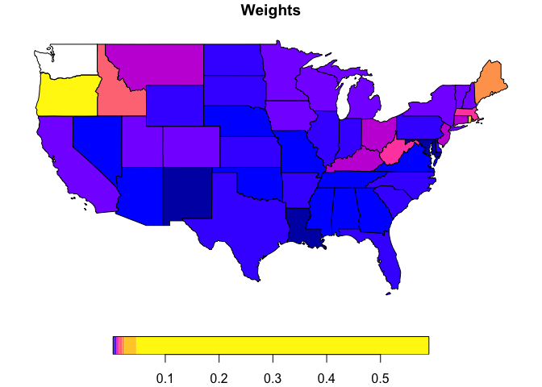
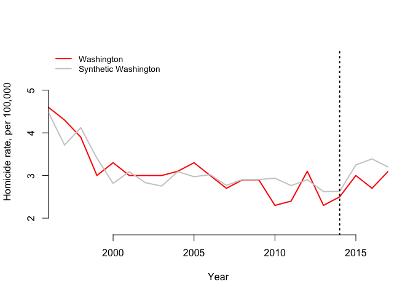
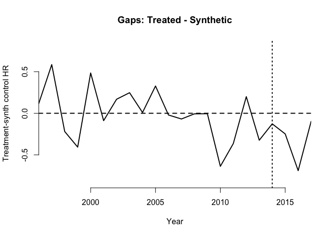

# Background

There's been a fair amount of excitement about a new method for estimating the effect of policies without random assignment. This method is called 'synthetic controls'. The synthetic control method was introduced by Abadie et al. in 2013 [check] and applied in the paper to an evaluation of a tabacco tax in California. Here we will introduce the intuition behind the method and apply it to a question that has been in the news: does legalising marajuana increase murder rate? 

At a simplistic level, the method combines parts of propensity scores, difference in difference, and interrupted time series analyses. It requires data from multiple time periods collected before the introduction of the intervention in both the place that gets the intervention and in other places that do not. These data are used to compare the trend in the outcome in the place that will get the treatment, with the trend in the places that will not. In most cases, the trends will not be the same, both in intercept (i.e. height of the line on a graph) or slope. What the synthetic control method does is generate a column of weights so that the weighted-average of the data in the places that will not get the intervention is as close as possible to the trend in the place that will -- this weighted-average is the 'synthetic' (i.e. not real but manufactured) control. 

The proponsity-score aspect is that confounding is being accounted for with weights rather than adjustment with confounder-data in a model. The difference-in-differences element is that data from before the introduction of the intervention is being used to account for baseline differences. The advantage of synthetic controls method is that it can be applied even when there is evidence that the parallel-lines assumption is not met; that is, when there the trends in the treated and untreated places are not parallel before the treatment is introduced. The interrupted time-series element is that the approach tried to account for trends, although unlike most ITS methods it does this non-parametrically and does not try to model fluctuations in the trend. 

Once the synthetic control has been generated the weights are applied to an average of the data collected after the treatment has started in the treatment unit and this weighted average is compared to the observed level of the outcome in the treated unit. Any difference is interpreted as the effect of the treatment. Since the method is non-parametric, permutation tests have been used to see if how consistent the difference is with chance. 

## So, does marijuana increase the murder rate?

There has been some reporting that marijuana might be causing more violence. This was based on a study that looked at the murder rate in Washinton state -- where marijuanna has been legalised -- compared to other states. The method of action is that perhaps smoking too much weed causes psychosis, and that maybe some people become more violent with psychosis. 

Of course, the trouble with comparing the murder rate in one state with others is that there might be other differences between the states, other than the legal status of marijuana. We wondered if the synthetic control method could be applied to this question, and thought it would be an interesting learning tool for others to get some insight into how the method works. 

This walk-through uses the statistical package R, but at the end or the article there is also a link to a Stata .do file that does most of the same things. We have focused on the R implementation because R is free to use (you can download it now), it produces nicer graphs, and the RMarkdown language makes it easy to embed code and output in the file. 

# Method 

## Step 1: load the packages 

R has many functions right-out-of-the-box, but often you will need to install additional software packages to increase the functionality. This is done in the chunk of code below, although the actual installation is commented-out so because it only needs to be run once on each computer.


```r
# Set options for the RMarkdown 
knitr::opts_chunk$set(echo = TRUE)

# Install the necessary packages 
# install.packages('openxlsx') # allows read-in of Excel files 
# install.packages('Synth') # the main Synth command 
# install.packages('sp') # package used to plot spatial data 
# install.packages('spData') # package with US states in it  
# install.packages('kableExtra') # package that makes the tables nicer  

# Load the packages into the workspace 
library(openxlsx)
library(Synth)
library(sf)
library(spData)
library(kableExtra)
```

## Step 2: Load some data 

We looked online for homocide data at the state-level, and also data on at least one important predictor of homocide. We found good data on unemployment, which tracks closely to the health of the local economy and is therefore correlated with a host of economic factors that could influence the homocide rate. Ideally we would have data on police numbers, public spending, other drug use, but to illustrate the application of synthetic control it is sufficient to limit to just two data sources. 


```r
# Load the data s
d_wide <- openxlsx::read.xlsx('HomocideData.xlsx')

# Update the column names 
colnames(d_wide)[2:ncol(d_wide)] <- paste0('HR.', colnames(d_wide)[2:ncol(d_wide)]) 

# Reshape the data, wide --> long
d <- reshape(d_wide, varying = 2:23, direction='long')

# Add unemployment rate 
u_wide <- openxlsx::read.xlsx('emp-unemployment.xlsx', sheet=2)
u_wide <- u_wide[6:56, c(2, seq(19,ncol(u_wide),1))]

# Add 2016 and 2017 data & reshape, wide --> long
u_1617 <- openxlsx::read.xlsx('unem_16_17.xlsx',colNames=FALSE)
u_wide <- cbind(u_wide, u_1617[,2:3])
colnames(u_wide) <- c('STATE', paste0('UR.', (1996:2017)))
u <- reshape(u_wide, varying = 2:23, direction='long')

# Merge (join) homocide and unemployment data  
d <- merge(d, u[,1:3], by=c('STATE', 'time'))

# Export data as CSV to be used in Stata
write.csv(d, 'data.csv', row.names = FALSE)
```

## Step 3: prepare the data for the synth command 

This step, which you can look at in the code below, is just technical. The `synth` command in R needs the data to be prepared in a particular way. We tell the function that the intervention is introduced in 2014, that the only treated State is Washington, and that the optimisation of the weighted average should be done using the data from 1996-2013 using the homocide rate and the unemployment rate. 


```r
# Prep data for synth
d_synth <- dataprep(d, dependent='HR', 
                    unit.variable='id', 
                    unit.names.variable='STATE',
                    treatment.identifier='Washington',
                    controls.identifier = unique(d$STATE)[-which(unique(d$STATE) %in%
                                                                   'Washington')],
                    time.variable='time',
                    time.optimize.ssr=(1996:2013),
                    time.predictors.prior=(1996:2013),
                    time.plot = 1996:2017,
                    predictors=c('UR','HR'), predictors.op = 'mean'
                    )
```

## Step 4: Descriptive analysis 

Instead of rushing straight to the synthetic controls command, we can first look at how Washington's homocide rate compares to the other states. We first plotted the mean homocide rates over the whole period, in order of decreasing rate, with Washington highlighted in red:


```r
# Summarise each state by the mean homocide rate 
m     <- aggregate(HR ~ STATE,data=d,FUN=mean)
# Mark Washinton in red 
m$colour <- ifelse(m$STATE=='Washington', 'red','gray80')
# Order the data by the homocide rate 
m     <- m[order(m$HR, decreasing=T),]

# Plot the results
plot(m$HR, bty='n', pch=16, xlab='Rank', col=m$colour,
     ylab='Homicide rate, per 100,000', cex=1)
```

<!-- -->

Second, we plotted the trends over time, with Washington highlighted in red:


```r
# Plot the trends 
plot(loess(d$HR~d$time), type = 'n', ylim=c(min(d$HR),max(d$HR)), bty='n', xlab='Year', ylab='Homicide rate, per 100,000')

# Add the trends for each state in grey
for (n in unique(d$STATE)){
  x <- d[d$STATE == n,]
  lines(loess(x$HR~x$time),lwd=1, col='gray80')
}

# Add the trends for Washinton in red 
lines(loess(d$HR[d$STATE=='Washington']~d$time[d$STATE=='Washington']),lwd=2, col='red', ylim=c(min(d$HR),max(d$HR)))
```

<!-- -->

So we can see that while on average Washington has a lower homicide rate than other states, the trend is in the pack of trends in other states, with lines above and below. This implies that with the right weighting it would be possible to create a weighted average of the trends in other states that lay along the trend in Washington. 


```r
s <- synth(data.prep.obj = d_synth, method="All")
```

# Results 
## Weights 

So now we have generated the synthetic control, what does it look like? First we can look at the mean levels of the input variables in the Washington and the synthetic Washington. 


```r
t <- synth.tab(d_synth, synth.res=s)
knitr::kable(t$tab.pred, col.names = c('Washington','Synthetic Washington','All states')) %>%
  kable_styling() 
```

<table class="table" style="margin-left: auto; margin-right: auto;">
 <thead>
  <tr>
   <th style="text-align:left;">   </th>
   <th style="text-align:right;"> Washington </th>
   <th style="text-align:right;"> Synthetic Washington </th>
   <th style="text-align:right;"> All states </th>
  </tr>
 </thead>
<tbody>
  <tr>
   <td style="text-align:left;"> UR </td>
   <td style="text-align:right;"> 6.533 </td>
   <td style="text-align:right;"> 6.533 </td>
   <td style="text-align:right;"> 5.593 </td>
  </tr>
  <tr>
   <td style="text-align:left;"> HR </td>
   <td style="text-align:right;"> 3.117 </td>
   <td style="text-align:right;"> 3.117 </td>
   <td style="text-align:right;"> 4.804 </td>
  </tr>
</tbody>
</table>

We can see that they are very similar on both homocide rate and the unemployment rate, and that these are both different from the overall means of either.

We know that the synthetic Washington is a weighted average of the other states, so what are those weights? Which states are most highly weighted, and which less so?


```r
# Merge the weights from the Synth command with US states 
weights <- merge(us_states, t$tab.w[,1:2], 
                 by.x='NAME', by.y='unit.names', all.x=TRUE)
# Plot the US states 
plot(weights['w.weights'], main='Weights', breaks='jenks')
```

<!-- -->

The plot isn't that easy to read, but we can see that a lot of weight is on Utah and then on the coastal states. What is interesting is that most states are included at some level in the synthetic Washington. We can see this more clearly in the table below.


```r
knitr::kable(t$tab.w[,c(2,1)],
             row.names = F,
             col.names = c('State','Weight')) %>%  
  kable_styling() %>%
  scroll_box(width = "500px", height = "200px")
```

<div style="border: 1px solid #ddd; padding: 5px; overflow-y: scroll; height:200px; overflow-x: scroll; width:500px; "><table class="table" style="margin-left: auto; margin-right: auto;">
 <thead>
  <tr>
   <th style="text-align:left;"> State </th>
   <th style="text-align:right;"> Weight </th>
  </tr>
 </thead>
<tbody>
  <tr>
   <td style="text-align:left;"> Alabama </td>
   <td style="text-align:right;"> 0.005 </td>
  </tr>
  <tr>
   <td style="text-align:left;"> Alaska </td>
   <td style="text-align:right;"> 0.010 </td>
  </tr>
  <tr>
   <td style="text-align:left;"> Arizona </td>
   <td style="text-align:right;"> 0.005 </td>
  </tr>
  <tr>
   <td style="text-align:left;"> Arkansas </td>
   <td style="text-align:right;"> 0.006 </td>
  </tr>
  <tr>
   <td style="text-align:left;"> California </td>
   <td style="text-align:right;"> 0.009 </td>
  </tr>
  <tr>
   <td style="text-align:left;"> Colorado </td>
   <td style="text-align:right;"> 0.008 </td>
  </tr>
  <tr>
   <td style="text-align:left;"> Connecticut </td>
   <td style="text-align:right;"> 0.010 </td>
  </tr>
  <tr>
   <td style="text-align:left;"> Delaware </td>
   <td style="text-align:right;"> 0.006 </td>
  </tr>
  <tr>
   <td style="text-align:left;"> Florida </td>
   <td style="text-align:right;"> 0.006 </td>
  </tr>
  <tr>
   <td style="text-align:left;"> Georgia </td>
   <td style="text-align:right;"> 0.005 </td>
  </tr>
  <tr>
   <td style="text-align:left;"> Hawaii </td>
   <td style="text-align:right;"> 0.010 </td>
  </tr>
  <tr>
   <td style="text-align:left;"> Idaho </td>
   <td style="text-align:right;"> 0.020 </td>
  </tr>
  <tr>
   <td style="text-align:left;"> Illinois </td>
   <td style="text-align:right;"> 0.006 </td>
  </tr>
  <tr>
   <td style="text-align:left;"> Indiana </td>
   <td style="text-align:right;"> 0.006 </td>
  </tr>
  <tr>
   <td style="text-align:left;"> Iowa </td>
   <td style="text-align:right;"> 0.008 </td>
  </tr>
  <tr>
   <td style="text-align:left;"> Kansas </td>
   <td style="text-align:right;"> 0.006 </td>
  </tr>
  <tr>
   <td style="text-align:left;"> Kentucky </td>
   <td style="text-align:right;"> 0.010 </td>
  </tr>
  <tr>
   <td style="text-align:left;"> Louisiana </td>
   <td style="text-align:right;"> 0.003 </td>
  </tr>
  <tr>
   <td style="text-align:left;"> Maine </td>
   <td style="text-align:right;"> 0.024 </td>
  </tr>
  <tr>
   <td style="text-align:left;"> Maryland </td>
   <td style="text-align:right;"> 0.003 </td>
  </tr>
  <tr>
   <td style="text-align:left;"> Massachusetts </td>
   <td style="text-align:right;"> 0.012 </td>
  </tr>
  <tr>
   <td style="text-align:left;"> Michigan </td>
   <td style="text-align:right;"> 0.008 </td>
  </tr>
  <tr>
   <td style="text-align:left;"> Minnesota </td>
   <td style="text-align:right;"> 0.009 </td>
  </tr>
  <tr>
   <td style="text-align:left;"> Mississippi </td>
   <td style="text-align:right;"> 0.005 </td>
  </tr>
  <tr>
   <td style="text-align:left;"> Missouri </td>
   <td style="text-align:right;"> 0.005 </td>
  </tr>
  <tr>
   <td style="text-align:left;"> Montana </td>
   <td style="text-align:right;"> 0.010 </td>
  </tr>
  <tr>
   <td style="text-align:left;"> Nebraska </td>
   <td style="text-align:right;"> 0.005 </td>
  </tr>
  <tr>
   <td style="text-align:left;"> Nevada </td>
   <td style="text-align:right;"> 0.005 </td>
  </tr>
  <tr>
   <td style="text-align:left;"> New Hampshire </td>
   <td style="text-align:right;"> 0.009 </td>
  </tr>
  <tr>
   <td style="text-align:left;"> New Jersey </td>
   <td style="text-align:right;"> 0.010 </td>
  </tr>
  <tr>
   <td style="text-align:left;"> New Mexico </td>
   <td style="text-align:right;"> 0.004 </td>
  </tr>
  <tr>
   <td style="text-align:left;"> New York </td>
   <td style="text-align:right;"> 0.009 </td>
  </tr>
  <tr>
   <td style="text-align:left;"> North Carolina </td>
   <td style="text-align:right;"> 0.006 </td>
  </tr>
  <tr>
   <td style="text-align:left;"> North Dakota </td>
   <td style="text-align:right;"> 0.006 </td>
  </tr>
  <tr>
   <td style="text-align:left;"> Ohio </td>
   <td style="text-align:right;"> 0.010 </td>
  </tr>
  <tr>
   <td style="text-align:left;"> Oklahoma </td>
   <td style="text-align:right;"> 0.005 </td>
  </tr>
  <tr>
   <td style="text-align:left;"> Oregon </td>
   <td style="text-align:right;"> 0.590 </td>
  </tr>
  <tr>
   <td style="text-align:left;"> Pennsylvania </td>
   <td style="text-align:right;"> 0.006 </td>
  </tr>
  <tr>
   <td style="text-align:left;"> Rhode Island </td>
   <td style="text-align:right;"> 0.046 </td>
  </tr>
  <tr>
   <td style="text-align:left;"> South Carolina </td>
   <td style="text-align:right;"> 0.006 </td>
  </tr>
  <tr>
   <td style="text-align:left;"> South Dakota </td>
   <td style="text-align:right;"> 0.006 </td>
  </tr>
  <tr>
   <td style="text-align:left;"> Tennessee </td>
   <td style="text-align:right;"> 0.005 </td>
  </tr>
  <tr>
   <td style="text-align:left;"> Texas </td>
   <td style="text-align:right;"> 0.006 </td>
  </tr>
  <tr>
   <td style="text-align:left;"> Utah </td>
   <td style="text-align:right;"> 0.009 </td>
  </tr>
  <tr>
   <td style="text-align:left;"> Vermont </td>
   <td style="text-align:right;"> 0.008 </td>
  </tr>
  <tr>
   <td style="text-align:left;"> Virginia </td>
   <td style="text-align:right;"> 0.005 </td>
  </tr>
  <tr>
   <td style="text-align:left;"> West Virginia </td>
   <td style="text-align:right;"> 0.014 </td>
  </tr>
  <tr>
   <td style="text-align:left;"> Wisconsin </td>
   <td style="text-align:right;"> 0.009 </td>
  </tr>
  <tr>
   <td style="text-align:left;"> Wyoming </td>
   <td style="text-align:right;"> 0.007 </td>
  </tr>
</tbody>
</table></div>

With so many states being needed to create the synthetic Washington, we can start to see the usefulness of this method. Had we just picked a state to compare Washington with -- say Oregon -- then we would not have been able to draw on all of the other states to bring the trend closer. Although heavily weighted, Oregon is only 59% of the synthetic Washington. 

## Comparing Washington with synthetic Washington 

Finally, we can start looking at how Washington and the synthetic Washington compare over time, and crucially after 2014. 


```r
# Update the 'path.plot' function to match formatting 
path.plot2 <- function (synth.res = NA, 
                        dataprep.res = NA, 
                        tr.intake = NA, 
                        Ylab = c("Y Axis"), 
                        Xlab = c("Time"), 
                        Ylim = NA, 
                        Legend = c("Treated", "Synthetic"),
                        Legend.position = c("topright"), 
                        Main = NA, Z.plot = FALSE){
  
        y0plot1 <- dataprep.res$Y0plot %*% synth.res$solution.w
        if (sum(is.na(Ylim)) > 0) {
            Y.max <- max(c(y0plot1, dataprep.res$Y1plot))
            Y.min <- min(c(y0plot1, dataprep.res$Y1plot))
            Ylim <- c((Y.min - 0.3 * Y.min), (0.3 * Y.max + Y.max))
        }
        plot(dataprep.res$tag$time.plot, dataprep.res$Y1plot, 
            t = "l", col = "red", lwd = 2, main = Main, ylab = Ylab, 
            xlab = Xlab, xaxs = "i", yaxs = "i", ylim = Ylim, bty='n')
        lines(dataprep.res$tag$time.plot, y0plot1, col = "gray80", 
             lwd = 2, cex = 4/5)
        
    abline(v = tr.intake, lty = 3, col = "black", lwd = 2)
    if (sum(is.na(Legend)) == 0) {
        legend(Legend.position, legend = Legend, 
               col = c("red", "gray80"), 
               lwd = c(2, 2), 
               cex = 6/7, bt='n')
    }
}

path.plot2(synth.res = s, dataprep.res = d_synth, 
          Ylab='Homicide rate, per 100,000', Xlab='Year',
          Legend=c('Washington', 'Synthetic Washington'),
          Legend.position=c('topleft'),tr.intake = 2014)
```

<!-- -->

To make it easier to see the difference between the two, we can plot it directly, as below: 


```r
# Slightly update the gaps plot to not have a box around it
gaps.plot2 <- function (synth.res = NA, 
                       dataprep.res = NA, 
                       Ylab = c("Title"), 
                       Xlab = c("Time"), 
                       Main = c("Gaps: Treated - Synthetic"), 
                       tr.intake = NA, 
                       Ylim = NA, 
                       Z.plot = FALSE) {

        gap <- dataprep.res$Y1plot - (dataprep.res$Y0plot %*% 
            synth.res$solution.w)
        if (sum(is.na(Ylim)) > 0) {
            Ylim <- c(-(0.3 * max(abs(gap)) + max(abs(gap))), 
                (0.3 * max(abs(gap)) + max(abs(gap))))
        }
        plot(dataprep.res$tag$time.plot, gap, t = "l", col = "black", 
            lwd = 2, main = Main, ylab = Ylab, xlab = Xlab, ylim = Ylim, 
            xaxs = "i", yaxs = "i", bty='n')
    abline(h = 0, col = "black", lty = "dashed", lwd = 2)
    abline(v = tr.intake, col = "black", lty = "dotted", lwd = 2)
}
gaps.plot2(synth.res = s, dataprep.res = d_synth,tr.intake=2014,
           Ylab='Treatment-synth control HR', Xlab='Year')
```

<!-- -->

# Conclusions 

## Stata implementation

This is all much easier in stata:


```r
ssc install synth, replace all 

cd /Users/calumdavey/Desktop/MJ/

// Open data 
import delim data.csv, clear

// Setup data 
tsset id time

// Graph
graph twoway (line hr time if id==47 ) ///
(lowess hr time if id!=47) , xline(2014)

// Run synth control
synth hr ur hr, ///
trunit(47) trperiod(2014) xperiod(1996(1)2013) fig keep(hrfig2) replace


use smoking, clear
tsset state year
graph twoway (line cigsale year if state==3 )(lowess cigsale year ///
if state!=3) , xline(1988) ytitle("Cigarette sale (packs per capita)") xtitle("Year") legend(label(1 "California") label(2 "Other US states"))
synth cigsale beer lnincome retprice age15to24 cigsale, trunit(3) trperiod(1989) xperiod(1980(1)1988) nested fig keep(abadie) replace
```

