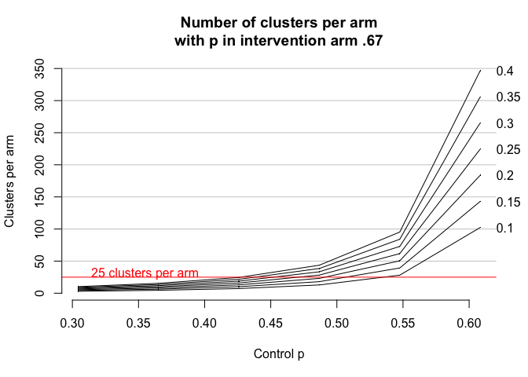
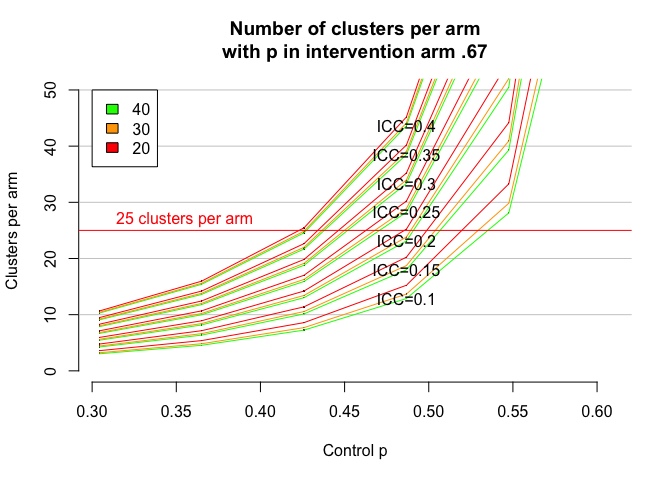

```r
#install.packages('clusterPower')
library(clusterPower)
```

## Set the parameters 

- Assume mean community 10,000, SD 5,000
- 1/5 age between 14-24, and 2% disabled 
- therefore mean of 10,000 * .2 * 0.02 = 40 eligible people per cluster


```r
m0 <- 40
#m_sd <- 20 # leaving m as constant for now, although should vary 
```

-  Assume that the effect of STAR+ similar to STAR, from table 5.3 in STAR eval report, weighted by gender balance in 5.1


```r
p_t <- .88*.71 + (1-.88)*.41
```

-  but that the control arm will perform less well, also from table 5.3 in STAR eval report, weighted by gender balance in 5.1, e.g. assume the trend over time will be more like the women in the STAR eval 

```r
p_c <- .88*.66 + (1-.88)*.23 # this is the overall employment level for the STAR report 
p_c <- p_c * seq(.5,1,.1)
```

## Set a number of possible ICC values 


```r
icc <- seq(0.1,0.4,0.05)
```

## Build the scenario dataset 


```r
d <- cbind(rep(p_c,times=length(icc)), rep(icc,each=length(p_c)))
d <- cbind(d, rep(p_t, nrow(d)), rep(m0, nrow(d)))
```

## Sample size calcs 

```r
d <- cbind(d, apply(d,1,function(x) crtpwr.2prop(n=x[4], p1=x[1], p2=x[3], icc=x[2])))
```

## Plot the results 

<!-- -->

## Explore the effect of lower values of m 

- compare the sample size calcs for mean cluster size of 40, 30, and 20


```r
m1 <- c(40,30,20)
d <- cbind(d[rep(seq_len(nrow(d)), length(m1)), ], rep(m1, each=nrow(d)))

# Re-calculate the power 
d <- cbind(d, apply(d,1,function(x) crtpwr.2prop(n=x[6], p1=x[1], p2=x[3], icc=x[2])))

# Restict to 50 clusters per arm or fewer 
# d <- d[d[,7]<=50, ]
```

<!-- -->
